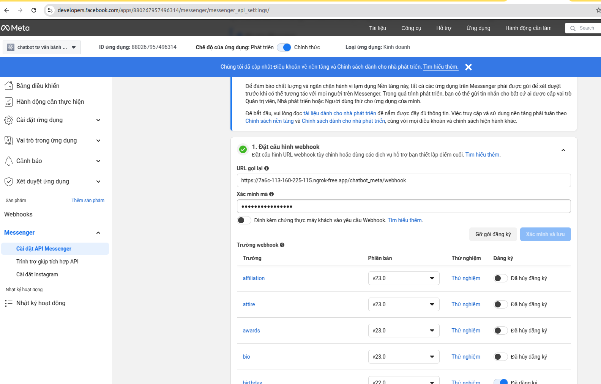

# Chạy với môi trường dev:
    Bước 1: truy cập vào project
    Bước 2: Run terminal (chạy docker pull image milvus, mysql ...):
        sudo docker compose -f docker-compose-db.yml up
    Bước 3: Chạy dữ liệu milvus visual database:
        ./run_attu.sh
    Bước 4: Cài conda, cài môi trường (tự cài)
        conda create -n chatbot python=3.11
        conda activate chatbot
    Bước 5: cài thư viện
        pip install -r requirements.txt
    Bước 6: python app/main.py

# Chạy với môi trường production:
(Chưa được test hoàn toàn, build theo cách này thì tự fix)
    Bước 1: truy cập vào project
    Bước 2: config .env
        # GEMINI KEY https://ai.google.dev/gemini-api/docs?hl=vi
        GOOGLE_API_KEY=...
        # https://api.openrouteservice.org/
        ORS_API_KEY=...
        # openai key
        OPENAI_API_KEY=...
        # https://developers.facebook.com/apps/
        # Đọc tài liệu và tự tạo page, app facebook: https://developers.facebook.com/docs/messenger-platform
        PAGE_FACEBOOK_ID=...
        PAGE_FACEBOOK_ACCESS_TOKEN=...
        PERSONA_ID_CHATBOT_FACEBOOK=...
        APP_SECRET_FACEBOOK=...
        APP_ID_FACEBOOK=...
        
        #FACEBOOK  app đã tạo
        PAGE_FACEBOOK_ACCESS_TOKEN: "EAAMgmVrp6foBO1bVqhvTCZCMKb4OL2RbeMIeDVkWiUVLtDNjoHOXWW6GlsPg2xYQCRZBbInfj2rcZBuC3dC654GvZCTZBA3uGED8EsUwbkvWLfBwByGZBkj2ludCE29G69SKILRA1Q2oN5ypCahvw8figXWNZBtUwbu4dNEv7FMFlXpLZC82ZAOCSZAiuWhchBJoPaHAZDZD"
        PERSONA_ID_CHATBOT_FACEBOOK: "510503718774158"
        APP_SECRET_FACEBOOK: "41b284b202183c4f10802c7030ecf1d2" # https://developers.facebook.com/apps/522453813790524/settings/basic/
        APP_ID_FACEBOOK: "880267957496314"

        CONFIG_PATH=./app/configs/prod.yaml
    Bước 2: Run terminal (chạy docker pull image milvus, mysql ...):
        sudo docker compose -f docker-compose.yml up
    Bước 3: Chạy dữ liệu milvus visual database:
        ./run_attu.sh
        => click vào link và đăng nhập theo ip, tk, mk theo env

# Sử dụng web:
http://localhost:3000/cake/web

# dữ liệu tại thư mục, bánh kem (embedding...)
./volumes

# Truy cập vào FB:
Link: https://developers.facebook.com/apps/880267957496314
Config domain và auth:

Điền:
- URL gọi lại: https://.../chatbot_meta/webhook
- Xác minh mã : PAGE_FACEBOOK_ACCESS_TOKEN